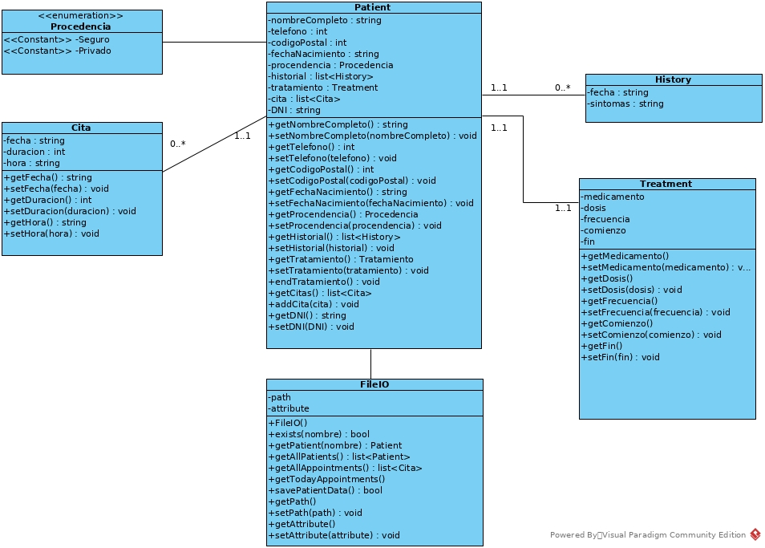

## Paciente
**Clase:** Paciente
**Descripción:** Contiene toda la información de un paciente
**Datos:**

 * nombreCompleto string; Nombre y Apellidos del paciente
 * telefono int; Teléfono de contacto del paciente
 * direccion string; Direccion del paciente
 * fechaNacimiento string; Fecha de nacimiento del paciente
 * procedencia Procedencia; Tipo de procedencia del paciente
 * historial list<History>; Historial del paciente
 * tratamiento list<Tratmiento>; Tratamientos activos del paciente
 * cita list<Cita>; Citas concertadas del paciente
 * DNI string; DNI del paciente

**Métodos:**

 * addCita - Añade una cita al paciente
 * addTratmiento - Añade un nuevo tratamiento al paciente
 * addHistorial - Añade una nueva entrada al historial del paciente
 * endTratamiento - Finaliza un tratamiento del paciente
 * getters y setters

## FileIO
**Clase:** FileIO
**Descripción:** Se encarga de obtener y guardar los pacientes comunicándose con los archivos de la aplicación 
**Datos:**

 * path string; Ruta donde buscará y guardará los archivos
 * instance FileIO; Instancia de la clase (Para el patrón Singleton)

**Métodos:**

 * getInstance - Devuelve la única instancia existente de la clase
 * exists - Comprueba si existe un paciente específico
 * buscarPaciente - Devuelve una lista con todos los pacientes cuyo nombre incluyan la string de búsqueda pasada como parámetro
 * getTodosPacientes - Devuelve una lista con todos los pacientes
 * getTodasCitas - Devuelve una lista con todas las citas de los pacientes
 * getCitasHoy - Devuelve una lista con las citas para el día actual
 * guardarPaciente - Guarda los datos de un paciente
 * getters y setters

## Cita
**Clase:** Cita
**Descripción:** Almacena la información de una cita concertada de un paciente
**Datos:**

 * fecha string; Fecha de la cita
 * hora string; Hora de la cita
 * duración int; Duración de la cita (en minutos)

**Métodos:**

 * getters y setters

## History
**Clase:** History
**Descripción:** Almacena la información de una entrada al historial
**Datos:**

 * fecha string; Fecha en la que se añadió la entrada
 * sintomas string; Síntomas del paciente

**Métodos:**

 * getters y setters

## Treatment
**Clase:** Treatment
**Descripción:** Almacena los datos del tratamiento de un paciente
**Datos:**

 * medicamento string; Medicamento recetado al paciente
 * dosis int; Dosis del medicamente (en miligramos)
 * frecuencia int; Frecuencia con la que se debe tomar el medicamente (en horas)
 * comienzo string; Fecha de comienzo del tratamiento
 * fin string; Fecha de finalización del tratamiento

**Métodos:**

 * getters y setters
